# CSE 5359 - Lab 1

## Compiling from source

To compile the program, simply run `make` in the current lab's root directory.
The binary file will be placed in the `bin/` folder and can be run using the command `./bin/main.out`.

## Running the Exploit

### Root directory

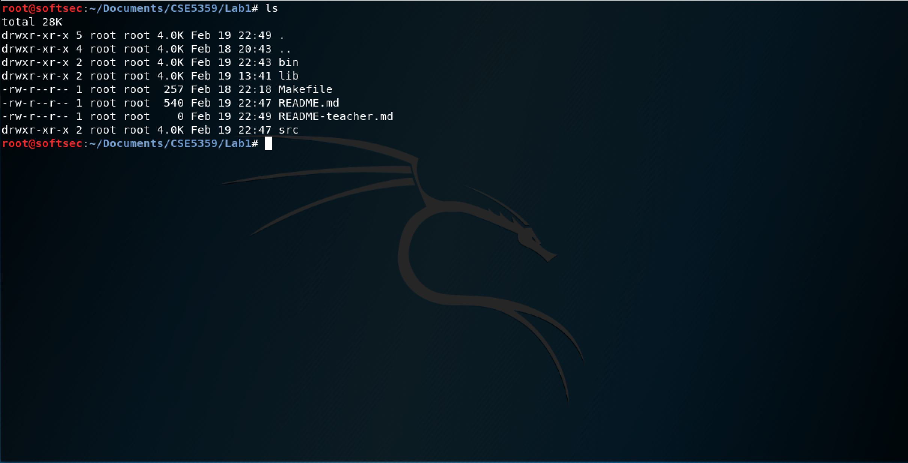

The root directory of the project looks as seen above.

### Compile the program

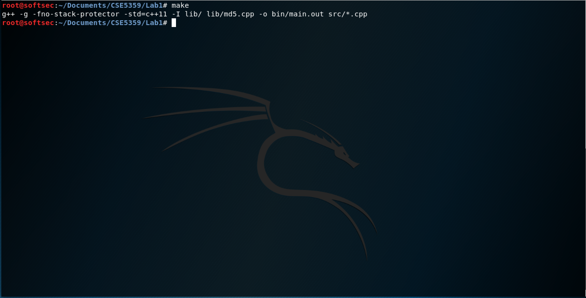

Compile the program with `make`.

### Run the program

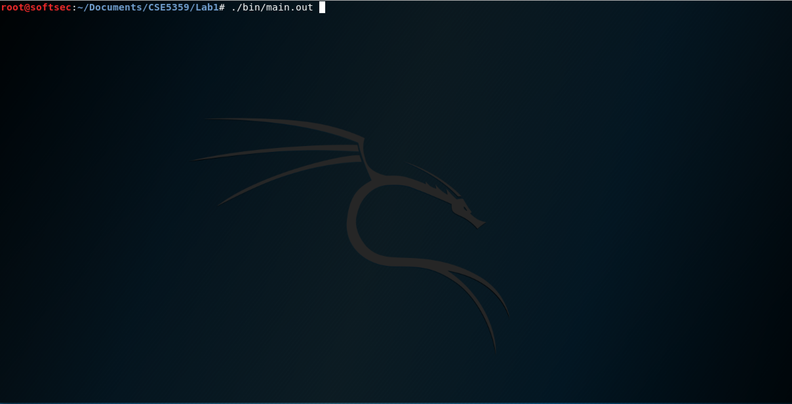

Run the program with `./bin/main.out`.

### Login

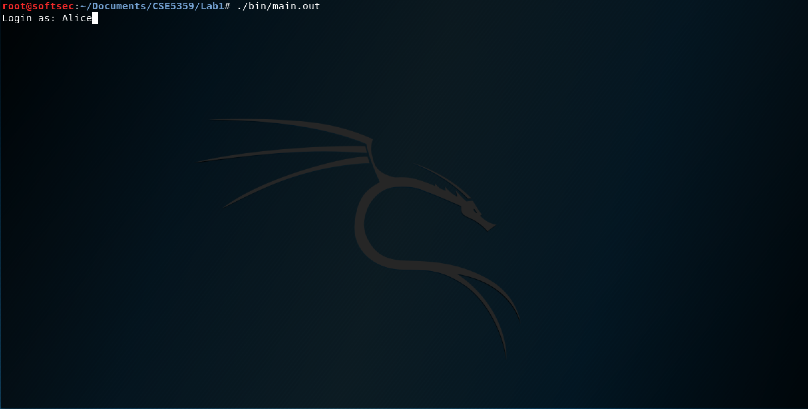
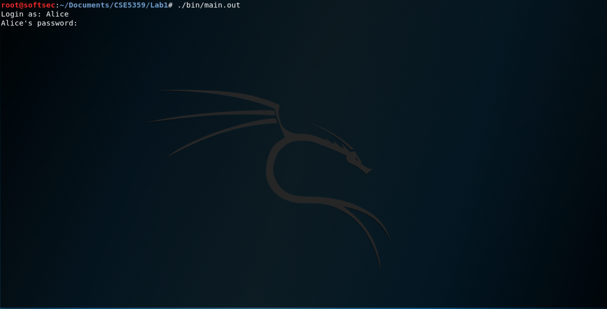

There are pre-configured accounts available. Check the source code for username/password combinations. The password is blank while typing.

### Main menu

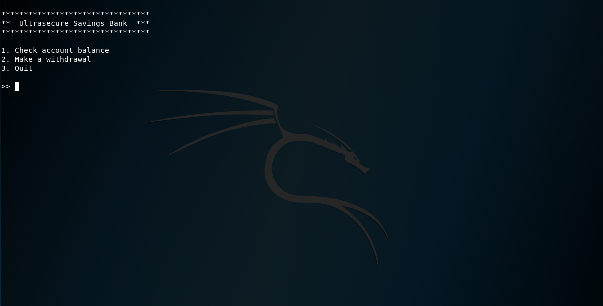

Successful login greets the user with the main menu.

### Check account balances

From the main menu, one can check the logged-in user's account balances in the checking and savings accounts.

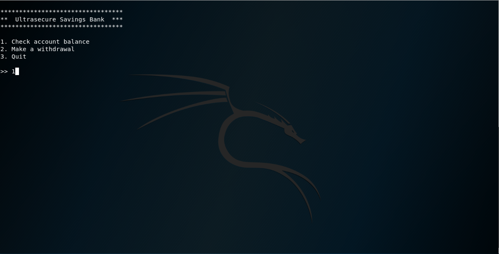
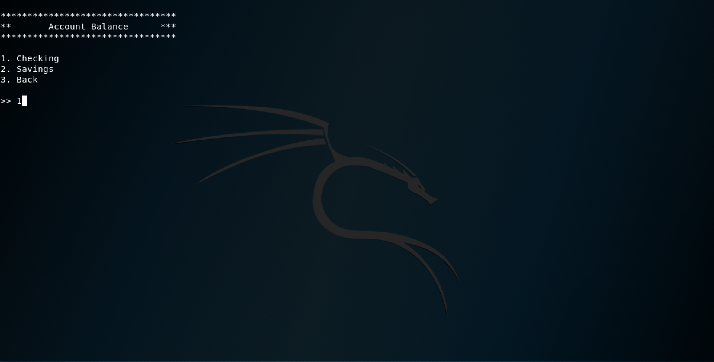
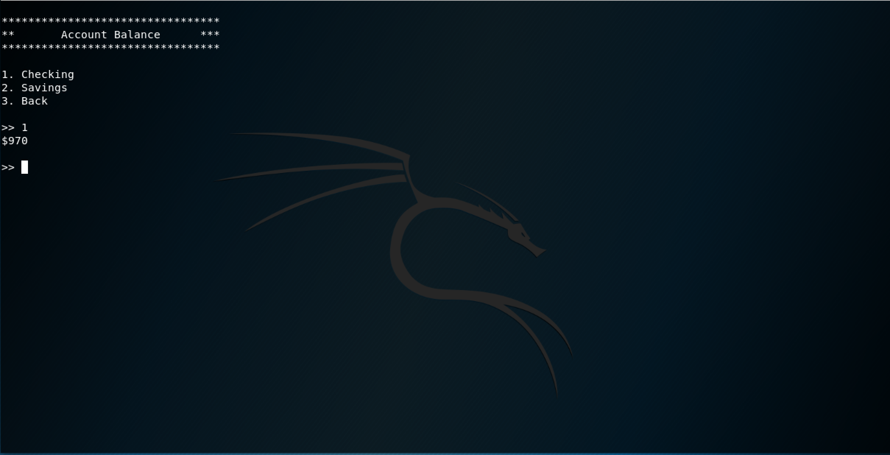

### Make withdrawals

Also, from the main menu, one can make withdrawals from the logged-in user's checking and savings accounts.

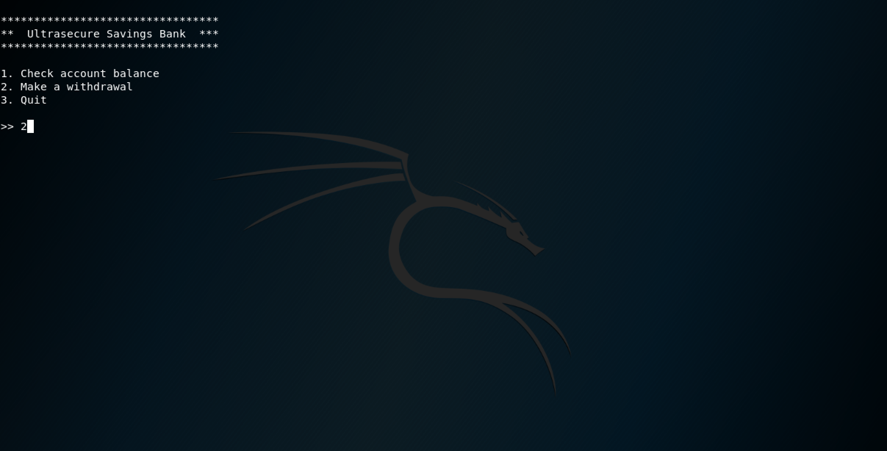
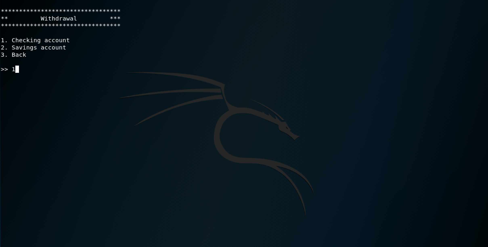
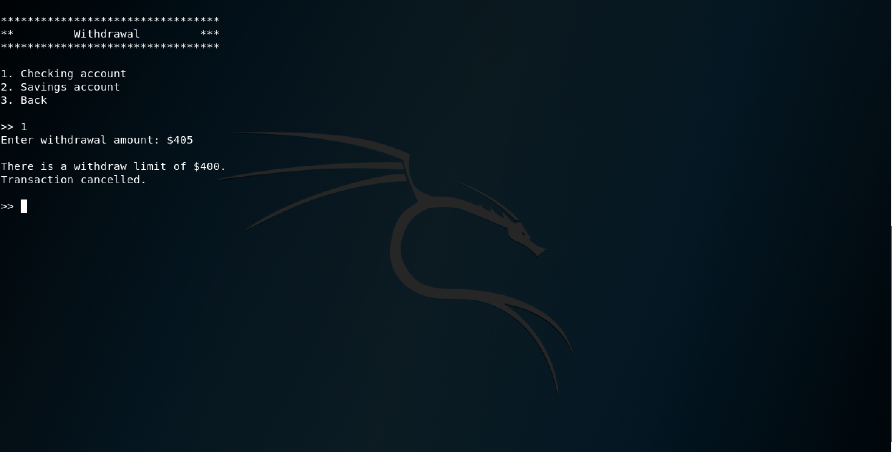

There is an imposed withdrawal limit of $400 per transaction.

### Break through the withdrawal limit

One can break through this limit with a certain input. Here, we use Python to generate 405 'A's in one string.
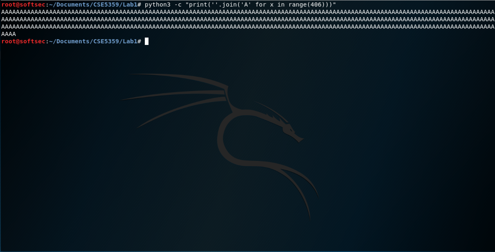

Copy the string for later use.
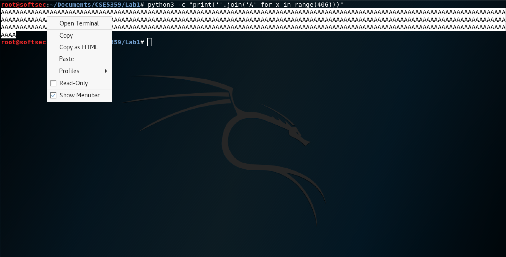

Paste the string into the withdrawal request, making sure to include the `%n` at the end (very important).
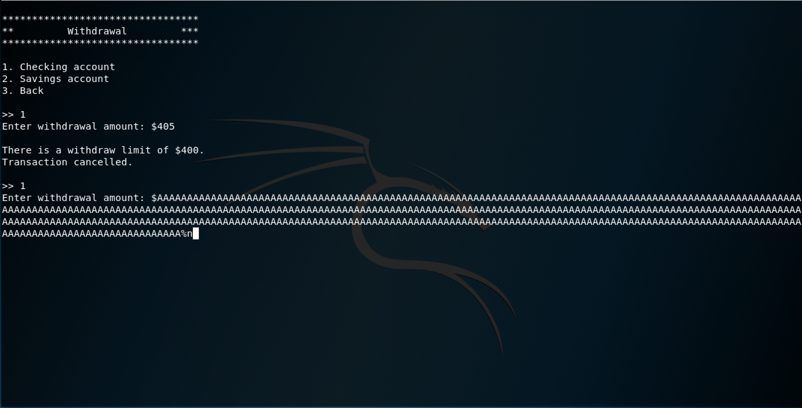

The withdrawal limit has been bypassed, as can be seen by the balance update after the withdrawal.
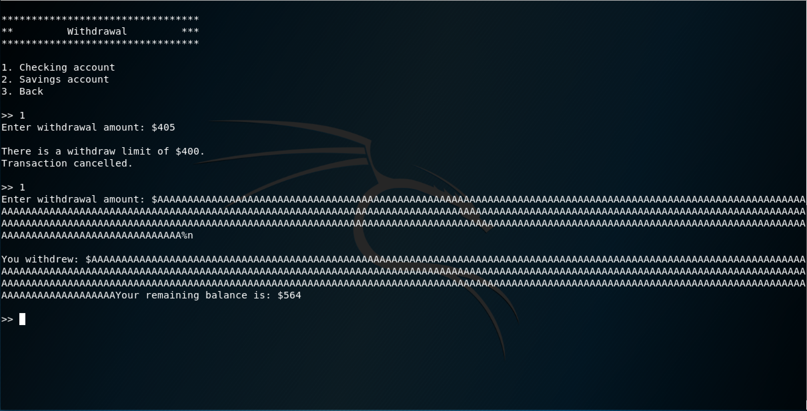