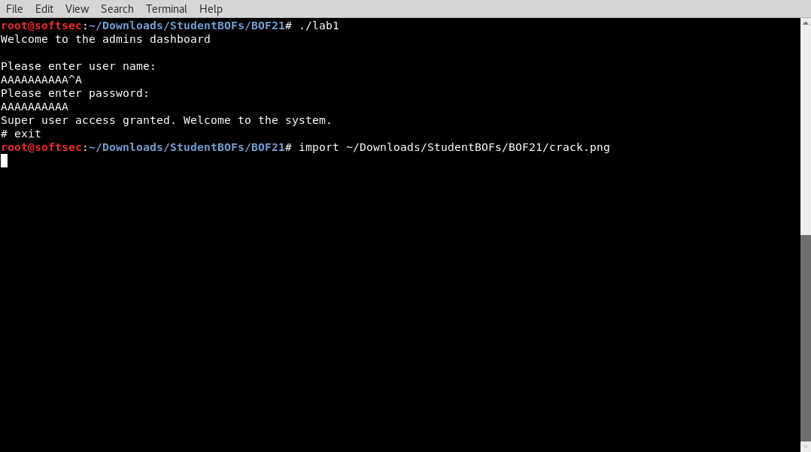

Robert Rash 
CSE 5359 
Dr. Estes 
8 March 2018 

## Lab 2 - Buffer overflow exploits

### General Approach
Step zero for this set of vulnerable programs is to read the `README`, if it has been provided. In the majority of cases, it provides much needed clarification as to the end goal of the exploit, which is much better than trying to take a guess at what the intended exploit may accomplish. 

After this, I open three terminal windows: one to read the code (Vim), one to interact with the program in `gdb`, and another to interact with the program in the shell.

Once my setup is established, I read through the code looking for a few things: the area(s) of code relevant to the intended exploit, buffers or other variables related to those areas (these are typically of type `char*`), and then methods of manipulating those variables with user input.

When I've found a set of variables to manipulate, I open the program in `gdb`, set a breakpoint at an appropriate location in the code, run the program, insert `'A'`s to fill up a given buffer (but not overflow it), continue execution until reaching the breakpoint, and use the `x/nx $sp` function to begin mapping the memory of a certain function. For both adjacent-data overwrites and return address overwrites, I can at this point begin to piece together the number of bytes needed to reach those areas in memory. Once this has been done, in the case of adjacent-data overwrites, I input _n_ bytes (usually `'A'`s) followed by the critical value. In the case of return address overwrites, I find the address of the desired function in `gdb` by running `print &<function_name>`, and follow the _n_ bytes with the desired address written in little endian byte notation (e.g. `0xbffff340 => \x40\xf3\xff\xbf`).

Once the exploit has been found in `gdb`, I run the same exploit in the terminal window and take a screenshot of the successful exploit.

### Exploits

#### BOF 1

**Stated goal:** earn money while answering all questions incorrectly.

The exploit for this involves overwriting the `currentMoney`. As `name` can be manipulated with user input, it means that it is the likely attack surface. As the output above shows, when the program prompts the user for their name, we can input whatever we want. Variables `int currentMoney`, `char bankAccount[16]`, and `char name[35]` are adjacent, so this exploit is as simple as writing 51 one-byte values (35 + 16 = 51) to the name buffer to reach the `currentMoney` variable in memory. At this point, we can input arbitrary ASCII values to overwrite `currentMoney`. In my case, I chose the printable ASCII value with the highest equivalent decimal value: `'~'` which is 126 decimal.

#### BOF 2

**Stated goal:** "find a way to beat [Bowser] before he depletes your health to 0."

This exploit can be accomplished by overflowing the `attack` buffer, which is only 4 bytes long. Since it's adjacent to the `att` variable, which is a number later subtracted from Bowser's health, it is possible to overflow `attack` and write a very large value into `att`. As the output above shows, a successful exploit (in this case inputting four `'A'`s and eight `'~'`s) can cause Bowser to end up with negative health after the first turn of the game, allowing the user to win.

#### BOF 3

This exploit requires shellcode injection, presumably to receive privileged shell access. Despite my best efforts, I was unable to achieve this exploit. There are only 40 bytes available to perform shellcode injection and execution, meaning there are very few arrangements in which to insert a NOP sled, shellcode, and then a return address inside the NOP sled.

#### BOF 4

**Stated goal:** "change the money you have." I interpret this to mean change the money you have without giving a "danation."

I achieved this exploit by overflowing the `reply` buffer into the (nearly) adjacent `money` variable. In my experience, a successful exploit required inputting 16 `'A'`s and then 4 `'~'`s. This resulted in a donation of $0 while receiving $2122203356 in return.

#### BOF 5

I was unable to accomplish the intended exploit in this program. 

#### BOF 6

**Stated goal:** enter the `Prohibited()` function, which never gets called in the other sections of the program.

I successfully exploited this vulnerability by overflowing the `buffer` variable to the extent that the saved return address gets overwritten with the desired memory address. Using `gdb`, I found the number of bytes needed to reach the area of memory where the saved return address is stored (32 bytes in this case) as well as the memory address of the `Prohibited()` function (`0x004005f3` in my case). I then used Perl to write 32 bytes and the desired memory address in little endian hex-byte notation to an input file. Using redirection, the file is used as input for the program. As the output shows, the desired function is executed, at the cost of not being able to return to `main()` after the function finishes execution.

**N.B.** This file originally came with a `'$'` in the file name. As most file systems are not friendly with these special characters in filenames, I removed the offending character before compiling the program. No code was altered.

#### BOF 7

**Stated goal:** purchase items and be refunded more money than the the user started with.

The successful exploit for this program involved overflowing the `quit` buffer into the `wallet` variable. The user can manipulate this buffer when opting to quit the application, where the program prompts the user to confirm whether they wish to quit. In my case, overwriting the `wallet` value was as simple as entering 10 `'A'`s followed by a `'~'`, at which point I had bought nothing but set my wallet as containing $126, as the program's exiting statement can show.

#### BOF 8

**Stated goal:** "hit the < jackpot() > function."

This buffer overflow is involves overwriting the return address with that of the `jackpot()` function. This can be done by entering 36 `'A'`s followed by the address of the `jackpot()` function. The screenshot above shows a successful exploit despite not entering correct credentials.

#### BOF 9

**Stated goal:** "The final cost will be $0 and it will not seg fault."

This is a simple overwrite of an adjacent value. The user has control over the `name` variable, which by means of `strcat` and the `purchaseInfo` buffer is essentially adjacent to the `price` variable. `price` is of type `float` and is used to determine the final price. I initially thought this was going to be difficult due to the nature in which floating point numbers are represented in memory; however, it ended up being as easy as entering 8 `'A'`s to overflow the `purchaseInfo` buffer and then entering three `'0'`s to force the final price to be zero.

#### BOF 10

**Stated goal:** "escalate the privilege of any normal user to admin level, such that logging in lists ALL transactions, including for users other than the one you logged in as."

The end goal of the exploit can be achieved by simply overwriting the `is_admin` flag as any number greater than zero. This can be done in the `authenticate()` function, where the user can enter in a username and password. In my case, I used the credentials for the user "mia", and when prompted for the password simply wrote the given password, enough bytes to fill out the rest of the buffer, and then a high-decimal-value ASCII value. Once this happens, not only do the credentials allow the user to successfully authenticate, the `is_admin` flag is set such that the program displays all transactions for all users.

#### BOF 11

**Stated goal:** none

Reading through the given source code, I interpret the end goal as being to dump the `map` containing all user IDs and their associated usernames.

This exploit requires overwriting the `dump` variable, the beginning of which lies 128 bytes away from the manipulable variable, `idBuff`. So as to attempt to pass the initial user ID check, the first part of the exploit contains a given user ID--in my case I used `000000001`. I then input 128 bytes followed by `<Ctrl>-a`, which is a control character equivalent to `\x01` and which will set `dump` to 1. As the output shows, while the user ID did not pass muster, `dump` was successfully replaced, and the user store was displayed.

#### BOF 12

**Stated goal:** access the `fmenu()` function, which uploads malware to eCorp's servers, wiping all credit.

`fmenu()` is only called when `char status == 'H'`. `status` can be changed to `'H'` by overwriting `char auth` in the `check()` function, which insecurely takes user input. `auth` can be changed by overwriting the `password` and `buf` buffers, which are size 20 and 5, respectively. So, for the password input, I simply entered 20 + 5 = 25 bytes followed by a single `'H'`, resulting in the malware being uploaded to eCorp's servers.

#### BOF 13

**Stated goal:** while the given `README` has a stated purpose, I'm not really sure how it fits with the given source code. Reading the source code, I feel like the goal is to overwrite the `get_rekt` variable so as to output the database login information.

The manipulable buffer is of size 256 and is adjacent to the `get_rekt` variable. I found that in memory the size of the buffer was actually allocated at 260 bytes, so I used Perl to enter in 260 bytes followed by the ASCII character whose decimal value is equivalent to the password indicated in the source code, which is `'d'`. The successful output is shown above.

#### BOF 14

**Stated goal:** "send out a real inbound missile alert to the residents of Hawaii using the provided CLI"

A successful exploit of this program involves overwriting the `status` variable located adjacent to the `passcode` buffer inside the `real_missile_alert()` function. Since `passcode` is directly manipulable, it is possible to exploit this by entering 56 `'A'`s followed by the control character `<Ctrl>-a`, which is equivalent to `\x01`. `status` is returned no matter what, so this successfully sends out a real inbound missile alert.

#### BOF 15

**Stated goal:** none

Reading the code, it's obvious that a successful exploit overwrites the `Boolean` variable in order to "log in."

This is about as simple as buffer overflows can get. Success requires entering 300 `'A'`s so as to overflow the `Buffer` buffer followed by a single `'T'` to set `Boolean` and "log in" despite having incorrect credentials.

#### BOF 16

_This was my own submission._

#### BOF 17

**Stated goal:** "find a way to manipulate the app into printing out all the credit card information that it has."

It takes two buffer overflow exploits to reach the end goal: one to overwrite `creditCardCount` and reach the `echo()` function, and another to overwrite `correct` in the `echo()` function with the value `'T'` so as to print out all the credit card info.

**Step 1** -- The user input in `main()` only ever writes to the `username` buffer, so in my example I simply put in the same data for both username and password prompts: 25 `'A'`s to fill up the buffer followed by `<Ctrl>-a` to set `creditCardCount` to 1.

**Step 2** -- `correct` can be overwritten by filling the `buffer` buffer with 20 `'A'`s and then a single `'T'`.

The successful exploit can be seen in the screenshot above.

#### BOF 18

**Stated goal:** "register product regardless of correct key."

It's impossible to reach the `validate()` function without already knowing the correct key, so this is a return address overwrite overflow. Inputting 32 bytes followed by the address of the `validate()` function successfully overflows the `key` buffer and points `%eip` to the `validate()` function, bypassing any sort of true validation. 

#### BOF 19

**Stated goal:** "cause the program to validate the serial number, even though a correct serial number is not entered" (huh, déjà vu).

Once again, this involves overwriting a return address. This can be done by inputting 36 bytes followed by the address of the `do_valid_stuff()` function to overflow the `serial` buffer located in the `validate_serial()` function and cause instruction flow to go to the `do_valid_stuff()` function. 

#### BOF 20

**Stated goal:** "access the administrator menu without having the proper credentials to do so."

This program can be exploited by first using given credentials to login as a student user (each separated by `\x0D` bytes to simulate pressing the `Enter` key), writing a few bytes to both break out of the `while` loop and fill up space, and then overwriting the return address with that of the `adminMenu()` function.

#### BOF 21

**Stated goal:** none

The source code reveals that the objective is to achieve authentication and get a shell.

The successful exploit overwrites the `cUsername` buffer and sets the adjacent `authentication` variable equal to 1. I achieved this by filling the buffer with 10 bytes and then the control character equivalent to 1. The `cPassword` variable has nothing to do with the exploit, so I just put in some arbitrary bytes.

**N.B.** this program would not compile due to illegal characters, which in my research is often found with copy-pasted code. Using a solution found [here](https://stackoverflow.com/a/45952830), I used the command `iconv -f utf-8 -t ascii//translit lab1.cpp > lab1-out.cpp` to "strip out" the illegal characters without manually modifying the source code.

#### BOF 22

**Stated goal:** none

Reading through the source code, it looks like the goal is to have the program display the password for the next session.

The new password will only be displayed if `good == 'T'`, which is only true when the correct password has been entered and `good` is assigned as `'T'`. `good` can be overwritten by choosing an R-rated movie and then inputting 20 bytes followed by a null byte (here, `<Ctrl>-@`) followed by the desired `'T'` value. This does not let the user rent the current movie, but does allow the user to have the password for next time.

#### BOF 23

_I skipped this program due to its complexity._