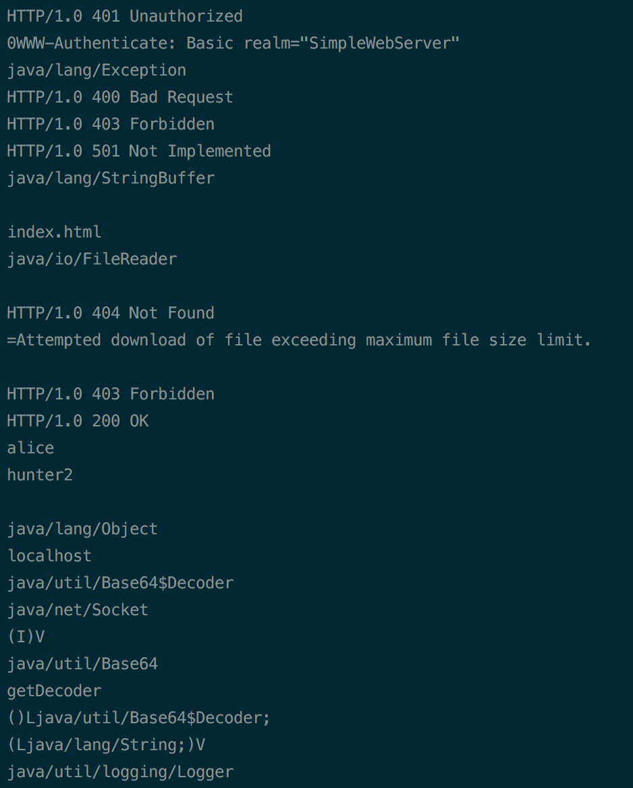
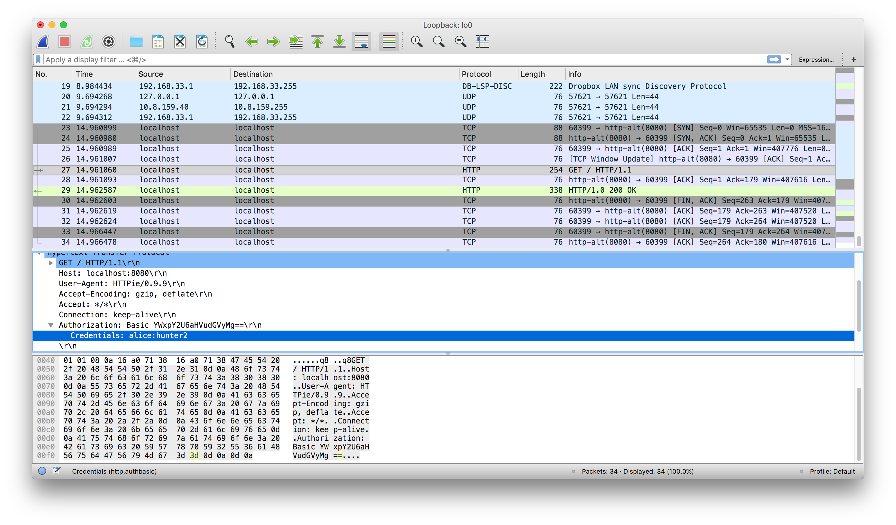

Robert Rash 
CSE 5359 
Dr. Estes 
5 April 2018 

## Lab 3 - Simple Web Server

### Problem 7

a. Since the size of the output buffer is continually checked against the maximum file size limit, an attacker attempting to access `/dev/random` would be met with the same response as though they were attempting to access a large file: `403 Forbidden`.

b. An alternate method of enforcing a file size limit would be through calls to the operating system. Operating systems maintain a filesystem, which efficiently stores metadata containing files' sizes.

### Problem 9

a. See either the source code in `src/` or the diffs provided in this directory (`doc/`).

b. The screenshot below shows a segment of the output of running `strings` on `SimpleWebServer.class`. These strings show all of the Strings used in the program such as the response messages, as well as some strings representing paths to objects used throughout the program, but hidden amongst these are two strings that seem out of place: `alice` and `hunter2`. These are the username and password that are hardcoded into the web server.

c. The Wireshark output below shows an HTTP request sent to the `SimpleWebServer` containing authentication credentials. The middle pane shows the `Authorization` header, and the drop down menu automatically recognizes the HTTP Basic authentication scheme and decodes the base64 encoded string. The provided credentials `alice` and `hunter2` can clearly be seen.

